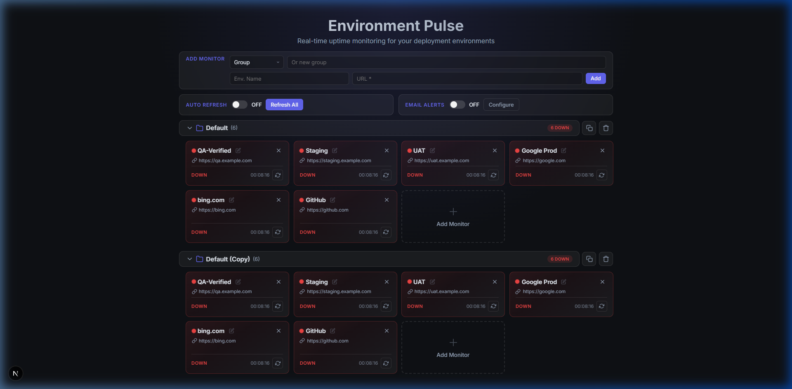
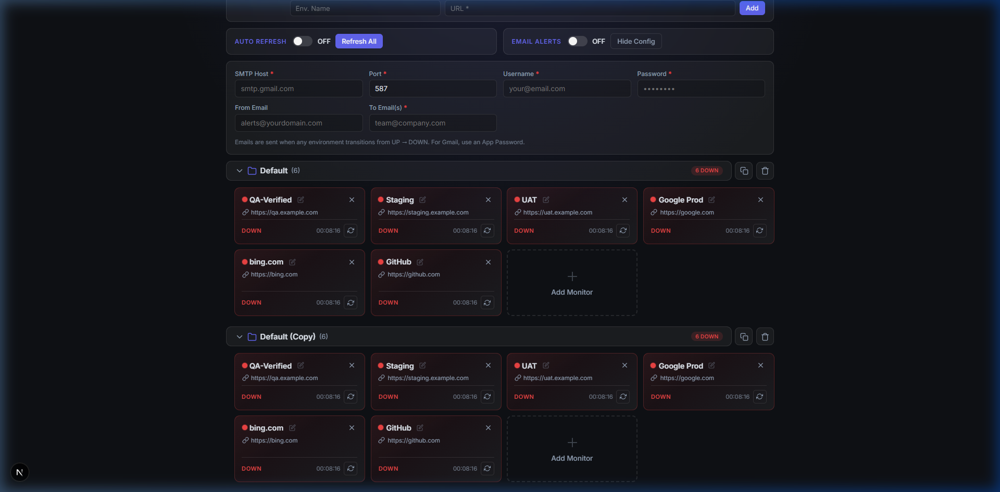
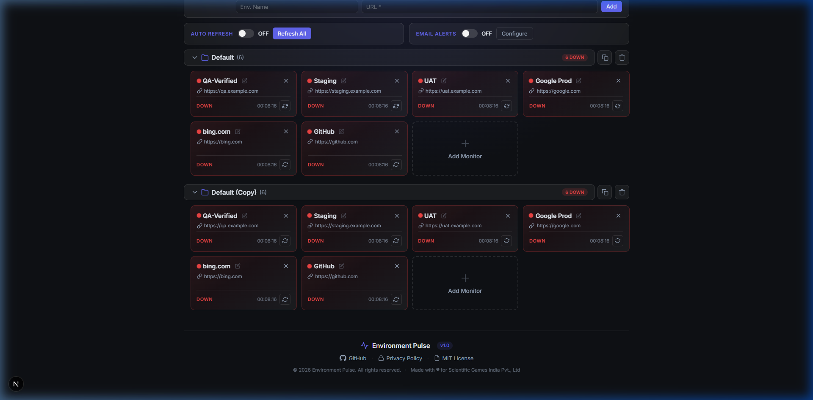

<div align="center">

# ⚡ Environment Pulse

**Real-time uptime monitoring for your deployment environments**


A sleek, dark-themed dashboard to monitor the health of your deployment environments — Dev, QA, Staging, UAT, Production — all at a glance.

</div>

---



## ✨ Features

### 🖥️ Dashboard & Monitoring
| Feature | Description |
|---------|-------------|
| **Real-time Status Checks** | Pings each URL and shows UP/DOWN with pulsing status dots |
| **Gradient Status Cards** | Green gradient for UP, red gradient for DOWN — instant visual feedback |
| **Auto-Refresh** | Configurable polling at 5s / 10s / 30s / 45s / 60s / 3m / 5m intervals |
| **Manual Refresh** | One-click "Refresh All" or per-card refresh button |
| **Compact Card Layout** | Space-efficient tiles fitting 4+ monitors per row |

### 📂 Group Management
| Feature | Description |
|---------|-------------|
| **URL Grouping** | Organize monitors into collapsible folder-like groups (Dev, QA, Staging, etc.) |
| **Group Badges** | Live UP / DOWN / Pending counts on each group header |
| **Group Duplicate** | Clone an entire group with all monitors in one click |
| **Group Delete** | Remove a group and all its monitors |
| **In-Group Add** | "+" tile at the end of each group for quick additions |
| **Drag-and-Drop Reorder** | Rearrange monitor tiles within a group by dragging |

### ✏️ Editing & Input
| Feature | Description |
|---------|-------------|
| **Inline Editing** | Always-visible pencil icon to edit name and URL directly on each card |
| **Optional Name** | Environment name auto-derives from URL hostname if left blank |
| **Character Limits** | 50 chars for names, 2000 chars for URLs |

### 📧 Email Alerts



| Feature | Description |
|---------|-------------|
| **SMTP Configuration** | Full SMTP setup (Host, Port, Username, Password, From, To) |
| **Auto-Trigger** | Sends email when any environment transitions from UP → DOWN |
| **Gmail Support** | Works with Gmail App Passwords on `smtp.gmail.com:587` |

### 🔔 Notifications & UI
| Feature | Description |
|---------|-------------|
| **Toast Notifications** | Slide-in toasts with progress bar for add, edit, delete, duplicate actions |
| **Privacy Policy** | Built-in privacy policy modal accessible from footer |
| **Space-Optimized Layout** | 2-row Add Monitor form, 50/50 Auto Refresh + Email Alerts row |
| **Persistent Settings** | All configurations saved in `localStorage` |

### 📄 Footer & Compliance



- Version badge (v1.0)
- GitHub repository link
- Privacy Policy modal
- MIT License reference
- © 2026 Environment Pulse — Made with ♥ for Scientific Games India Pvt., Ltd

---

## 🚀 Getting Started

### Prerequisites

- **Node.js** ≥ 18.x
- **npm** ≥ 9.x

### Installation

```bash
# Clone the repository
git clone https://github.com/karthikeyaguptha/AGProj.git
cd AGProj

# Install dependencies
npm install
```

### Development

```bash
# Start the development server
npm run dev
```

Open [http://localhost:3000](http://localhost:3000) in your browser.

### Production Build

```bash
# Build for production
npm run build

# Start the production server
npm start
```

The app will be available at [http://localhost:3000](http://localhost:3000).

---

## ⚙️ Configuration

### Adding Monitors

1. Use the **Add Monitor** form at the top of the dashboard
2. Select an existing group from the dropdown or type a new group name
3. Enter an environment name (optional — auto-derived from URL if blank)
4. Enter the URL to monitor (mandatory)
5. Click **Add**

### Setting Up Email Alerts

1. Toggle **Email Alerts** ON in the control bar
2. Click **Configure** to expand the SMTP settings panel
3. Fill in your SMTP details:

| Field | Example | Required |
|-------|---------|----------|
| SMTP Host | `smtp.gmail.com` | ✅ |
| Port | `587` | ✅ |
| Username | `your@email.com` | ✅ |
| Password | `app-password-here` | ✅ |
| From Email | `alerts@yourdomain.com` | ❌ |
| To Email(s) | `team@company.com` | ✅ |

> **Gmail Users:** Generate an [App Password](https://myaccount.google.com/apppasswords) and use it in the Password field. Regular passwords will not work.

### Auto-Refresh

Toggle **Auto Refresh** ON and select an interval. Available intervals:

`5s` · `10s` · `30s` · `45s` · `60s` · `3m` · `5m`

---

## 🏗️ Project Structure

```
AGProj/
├── src/
│   └── app/
│       ├── api/
│       │   ├── status/route.ts    # Health check proxy API
│       │   └── alert/route.ts     # Email alert API (Nodemailer)
│       ├── page.tsx               # Main dashboard component
│       ├── globals.css            # Complete design system
│       ├── layout.tsx             # Root layout with metadata
│       └── icon.svg               # Heartbeat favicon
├── docs/
│   └── screenshots/               # Documentation screenshots
├── LICENSE                         # MIT License
├── package.json
├── tsconfig.json
└── README.md
```

---

## 🔒 Privacy

Environment Pulse runs **entirely in your browser**. No data is sent to external servers beyond the health-check requests to your configured URLs. All configurations, SMTP credentials, and preferences are stored in `localStorage` on your device.

[View Full Privacy Policy →](docs/screenshots/privacy-policy.png)

---

## 📋 Changelog

### v2.0 — 2026-02-21

**🎨 UI/UX Overhaul Milestone**

#### Layout Redesign
- **2-Row Add Monitor form** — Row 1: Group selection, Row 2: Name + URL + Add button
- **50/50 Split Row** — Auto Refresh and Email Alerts now share one horizontal row
- **Split-top / Split-bottom pattern** — Toggle + ON/OFF on the label row, controls (interval buttons, Refresh All, Configure) on a dedicated second row
- **Compact card grid** — Reduced card size (220px min) with tighter padding, fitting 4+ tiles per row

#### Visual Polish
- Smaller card border-radius, font sizes, and spacing throughout
- Refined card footer with compact status text
- Compact Add Monitor tile (100px min-height)
- URL text with overflow ellipsis

#### Documentation
- Full README rewrite with feature tables, deployment guide, and configuration docs
- Embedded screenshots for dashboard overview, email config, footer, and privacy modal
- Added `docs/screenshots/` directory with 4 reference screenshots

#### Branding
- Heartbeat SVG favicon matching footer logo
- Attribution updated to Scientific Games India Pvt., Ltd

---

### v1.0 — 2026-02-21

**🎉 Initial Release**

#### Core Features
- Real-time environment status monitoring with UP/DOWN detection
- Gradient status cards with pulsing status indicators
- Auto-refresh with configurable intervals (5s to 5m)
- Manual per-card and global refresh

#### Group Management
- Collapsible URL grouping with folder icons and status badges
- Group duplicate, delete, and in-group monitor addition
- Drag-and-drop reordering of monitor tiles within groups

#### Monitor Controls
- Add Monitor form with group selector (2-row compact layout)
- Inline editing of environment name and URL
- Optional environment name (auto-derived from URL hostname)
- Character limits (50 for names, 2000 for URLs)

#### Email Alerts
- SMTP email configuration panel
- Automatic email notifications on UP → DOWN transition
- Gmail App Password support

#### UI & Polish
- Dark glassmorphism theme with smooth animations
- 50/50 split row for Auto Refresh + Email Alerts
- Compact space-efficient card grid (4+ per row)
- Toast notification system with auto-dismiss progress bar
- Built-in Privacy Policy modal
- Footer with copyright, GitHub, MIT License, version badge

#### Infrastructure
- Next.js 16 with App Router and TypeScript
- Server-side API routes for status checks and email alerts
- Nodemailer integration for email delivery
- localStorage persistence for all settings

---

## 📝 License

This project is licensed under the **MIT License** — see the [LICENSE](LICENSE) file for details.

---

<div align="center">

Made with ♥ for **Scientific Games India Pvt., Ltd**

</div>
